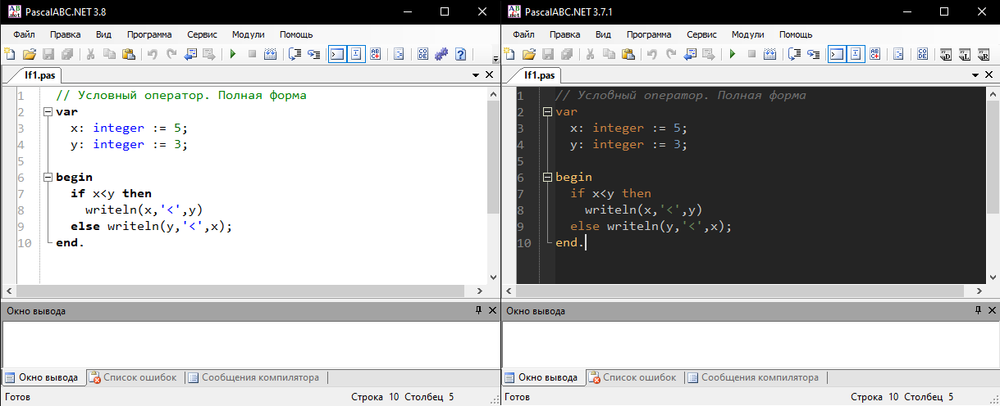
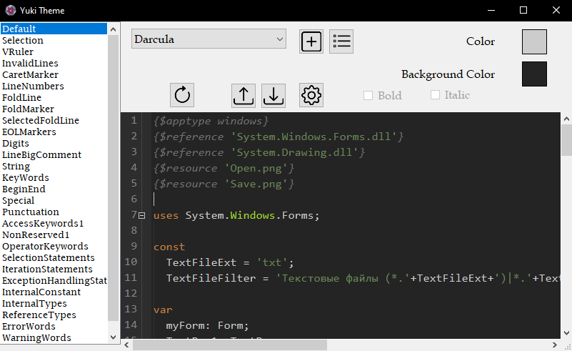
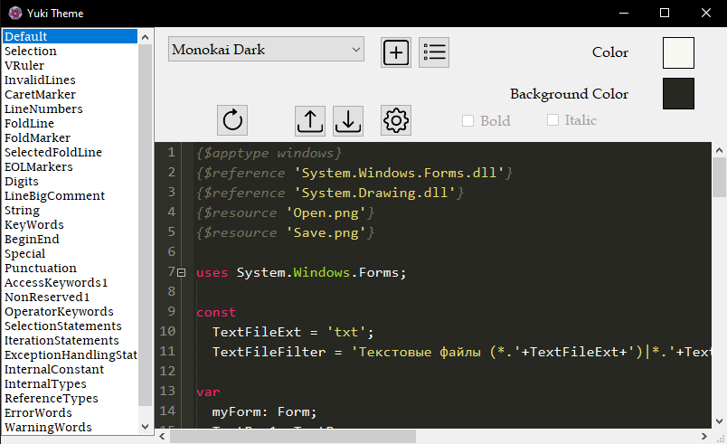

# Yuki-Theme

This program is for people, who want to customize PascalABC.NET IDE. By this program you can select and export default popular color schemes like: `Darcula`, `Monokai` and etc.
Or, you can make your own color scheme by clicking `plus` button. Also, you can import your color scheme from any JetBrains IDE, by clicking `Import`.

Before     |    After

## Installation

  Download the [latest release](https://github.com/Dragon-0609/Yuki-Theme/releases/latest) and extract it:  
  Extract the zip file to anywhere, after that open `Yuki Theme.exe`.
  
  ---
  
## Documentation
- [Configuration](#configuration)
- [Default Themes](#default-themes)
- [Custom Themes](#custom-themes)
  
## Configuration

You can access the settings menu by clicking `Settings` button. Here's some fields, that you can set:

- [Path to PascalABC.NET](#path-to-pascalabcnet)
- [Active Scheme](#active-scheme)
- [Remember Active Scheme](#remember-active-scheme)
- [Ask if there are other themes in PascalABC directory](#ask-if-there-are-other-themes-in-pascalabc-directory)
- [Do action, if there are other themes](#do-action-if-there-are-other-themes)
- [Setting Mode](#setting-mode)
- [Check Update](#check-update)

#### Path to PascalABC.NET:
It's necessary to export the scheme to the IDE.

#### Active Scheme
It will be shown in next program opening.

#### Remember Active Scheme
It sets current scheme to active scheme, so it will be shown in next program opening

#### Ask if there are other themes in PascalABC directory
It asks on exporting scheme to the IDE, if there are other themes in `Highlighting` directory inside `PascalABC.NET` directory

#### Do action if there are other themes 
If you uncheck `Ask if there are other themes in PascalABC directory`, the selected action will be done. There're 3 actions:
- Delete (old scheme)
- Import and Delete (old scheme)
- Ignore (old scheme)

#### Setting Mode
This checkbox is for custom coloring. It has 2 values: `Light` and `Advanced`.
`Light` is the easiest way to change colors. It shows only main syntax colors and applies to duplicate colors by itself. There're 4 types of comment colors. In `Light` mode it's shown as 1 color.
`Advanced` shows all colors. Also, there're duplicate colors. For example: there're 4 colors for Comments and etc.

#### Check Update
If the checkbox is checked, the programm will check updates in every program run. If there's update, the program will notify you.

---

## Default Themes
- Darcula (from JetBrains IDEA)
- Dracula
- Github Dark
- Github Light
- Monokai Dark
- Monokai Light
- Nightshade
- Oblivion
- Shades of Purple

---

## Custom Themes
You can create your own theme by pressing `Add` button. In there you can choose Name of the theme and default scheme for copy. After that, you can change colors of the theme.
Also, you can import your favourite color scheme from any JetBrains IDE. Click to `Import` button and select the file of the scheme.

### Attributions
Was inspired by [Doki Theme](https://github.com/doki-theme/doki-theme-jetbrains)  
Project uses [Fast Colored Text Box](https://github.com/PavelTorgashov/FastColoredTextBox), [Cyotek ColorPicker](https://github.com/cyotek/Cyotek.Windows.Forms.ColorPicker), [Newtonsoft.Json](https://github.com/JamesNK/Newtonsoft.Json).

---

## Contributions?

You probably have good ideas, so feel free to submit your feedback as [an issue](https://github.com/Dragon-0609/Yuki-Theme/issues/new). I'll read your feedback, so don't be shy!

Help make this plugin better!

---

    </img>

