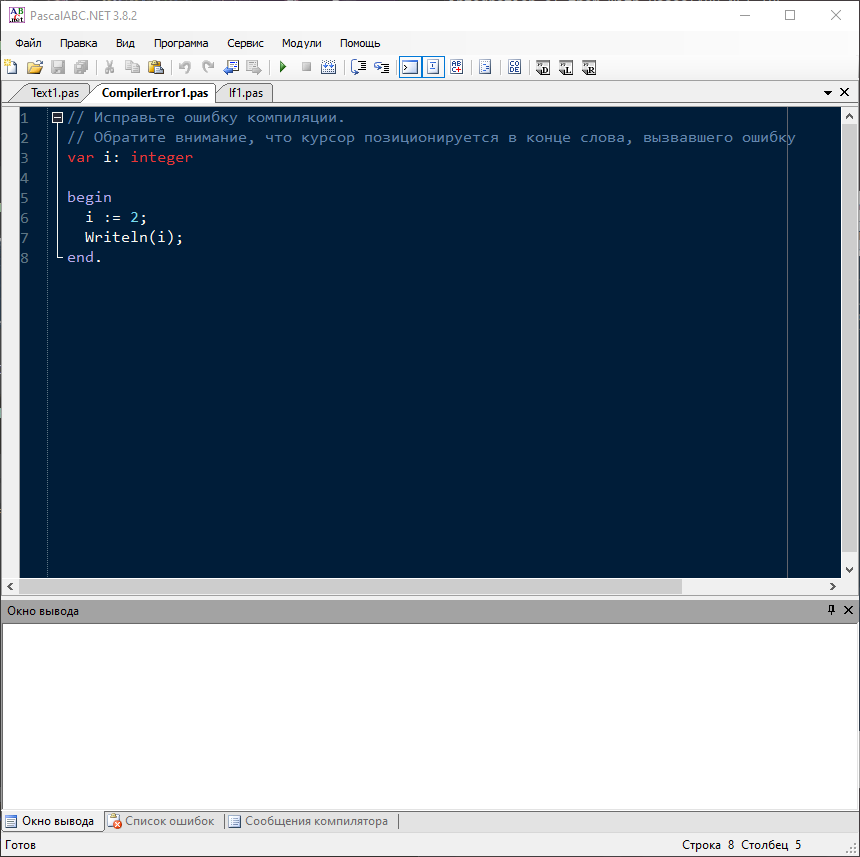
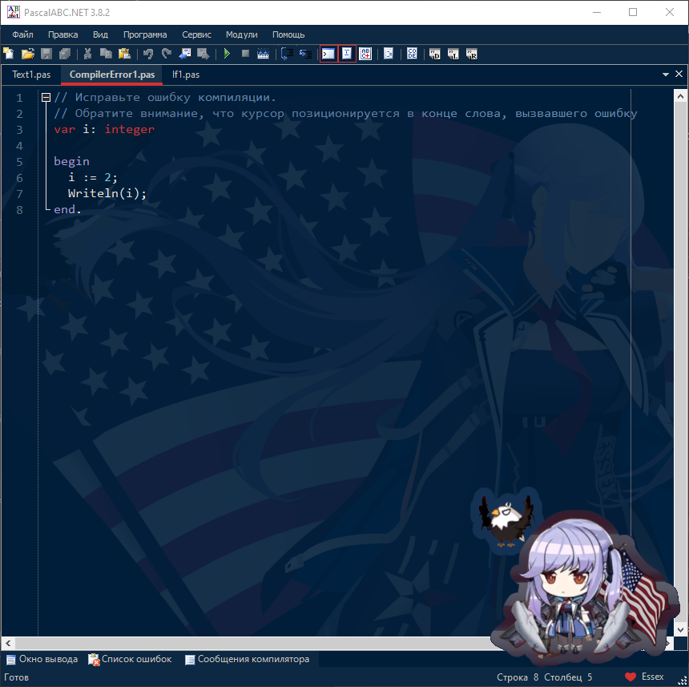
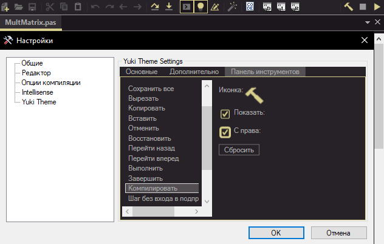

# Yuki Theme

## Languages | Языки
- [English](#english)
- [Русский](#русский)

## English

This program helps to customize PascalABC.NET IDE. By this program you can apply default popular color schemes like: `Darcula`, `Monokai` and etc.
Also, it includes `Doki Theme`, with over 50 themes, I think you will find the best girl.

Or, you can make your own color scheme by clicking `plus` button.

Before 

After

## Installation

[How to install](https://dragon-0609.github.io/Yuki-Theme/usage.html)

There're 2 types of `Yuki Theme`. `Program (.exe)` and `Plugin (.dll)`.
I recommend you to use `Plugin` version, but if there is something that crashes PascalABC.NET, you can use `Program` version. 

If you want to use `Plugin`:

Download the [latest release](https://github.com/Dragon-0609/Yuki-Theme/releases/latest) of plugin and extract it in `PascalABC.NET` directory.
[Guide](https://drive.google.com/file/d/1vCBG9YSQoLVYNxusWN7dstO2Tm2k7MtM/view?usp=sharing)

If you want to use `Program`:

Download the [latest release](https://github.com/Dragon-0609/Yuki-Theme/releases/latest) of program and extract the zip file to anywhere, after that open `Yuki Theme.exe`.

---

## What is difference between `Program` and `Plugin`?
Well, both of them are `Yuki Theme`. The difference is in integration of them with PascalABC.NET IDE.

If you use program version, you can change color syntax of the IDE, but it has limitations:

- [ ] Can set background image
- [ ] Can set sticker
- [ ] Can change color of UI parts
- [x] You have to restart PascalABC.NET to change theme
- [ ] Can change icons of the UI

`Plugin` version:
- [x] Can set background image
- [x] Can set sticker
- [x] Can change color of UI parts
- [x] Easily change theme at runtime
- [x] Name in the status bar of Pascal
- [x] Can change icons of the UI

Without plugin:

With plugin:

---

## Documentation
- [Features for plugin](#features-for-plugin)
- [Configuration](#configuration)
- [Default Themes](#default-themes)
- [Doki Theme](#doki-theme)
- [Custom Themes](#custom-themes)

### Features for plugin
#### Switch theme
You can easily change theme by using `switch theme`. To use it, press <code>Ctrl + `</code> (below Esc) in Pascal. After that small panel will appear on the center.

Also, you can easily hide background image and sticker by pressing `Alt + A`. To show them, just press `Alt + A` again. To easily enter to `Yuki Theme` window, press `Alt + S`.

#### Icons
Icons of the IDE are changed to JetBrains' icons. 

#### ToolBar Camouflage
You can hide or align to right any icon from the toolbar. To do this, open `Сервис -> Настройки`. After that choose `Yuki Theme`. Next press to `Toolbar`. Finally, here you can hide or align any icon.

### Configuration

You can access the settings menu by clicking `Settings` button. Here's some fields, that you can set:

- [Path to PascalABC.NET](#path-to-pascalabcnet)
- [Ask if there are other themes in PascalABC directory](#ask-if-there-are-other-themes-in-pascalabc-directory)
- [Do action, if there are other themes](#do-action-if-there-are-other-themes)
- [Setting Mode](#setting-mode)
- [Check Update](#check-update)
- [Show Background Image](#show-background-image)
- [Sticker](#sticker)
- [Ask to save](#ask-to-save)

#### Path to PascalABC.NET 
(You don't need it in `plugin` version):

It's necessary to export the scheme to the IDE.

#### Ask if there are other themes in PascalABC directory

(You don't need it in `plugin` version)

It asks on exporting scheme to the IDE, if there are other themes in `Highlighting` directory inside `PascalABC.NET` directory

#### Do action if there are other themes 

(You don't need it in `plugin` version)

If you uncheck `Ask if there are other themes in PascalABC directory`, the selected action will be done. There're 3 actions:
- Delete (old scheme)
- Import and Delete (old scheme)
- Ignore (old scheme)

#### Setting Mode
This checkbox is for custom coloring. It has 2 values: `Light` and `Advanced`.
`Light` is the easiest way to change colors. It shows only main syntax colors and applies to duplicate colors by itself. There're 4 types of comment colors. In `Light` mode it's shown as 1 color.
`Advanced` shows all colors. Also, there're duplicate colors. For example: there're 4 colors for Comments and etc.

#### Check Update
If the checkbox is checked, the programm will check updates in every program run. If there's update, the program will notify you.

#### Show Background Image
If you don't want to see background image, disable it

#### Sticker
If you don't want to see sticker, disable `Show Sticker`. 

#### Custom Sticker
You can set your custom sticker by enabling `Use Custom Sticker` and by choosing `Choose Image`.

#### Ask to save
If you enable it, the app will ask you to save the theme, if you want to select another theme or export after editing the theme.  

---

### Default Themes
- Darcula (from JetBrains IDEA)
- Dracula
- Github Dark
- Github Light
- Monokai Dark
- Monokai Light
- Nightshade
- Oblivion
- Shades of Purple

---

## Doki Theme

You can choose themes from various, Anime, Manga, or Visual Novels from [`Doki Theme`](https://github.com/doki-theme/doki-theme-jetbrains):

- A Certain Scientific Railgun
- Azur Lane
- Blend S
- Bunny Senpai
- Daily Life With A Monster Girl
- DanganRonpa
- Darling in the Franxx
- Doki-Doki Literature Club
- Don't Toy with me Miss Nagatoro
- EroManga Sensei
- Fate/Type-Moon
- Future Diary
- Gate
- High School DxD
- Jahy-sama Will Not Be Discouraged!
- Kakegurui
- Kill la Kill
- KonoSuba
- Literature Club
- Love Live!
- Love, Chunibyo & Other Delusions
- Lucky Star
- Miscellaneous
- Miss Kobayashi's Dragon Maid
- Monogatari
- NekoPara
- Neon Genesis Evangelion
- OreGairu
- OreImo
- Quintessential Quintuplets
- Re Zero
- Steins Gate
- Sword Art Online
- The Rising Of The Shield Hero
- Vocaloid
- Yuru Camp

---

### Custom Themes
You can create your own theme by pressing `Add` button. In there you can choose Name of the theme and default scheme for copy. After that, you can change colors and background image of the theme.
Also, you can import your favourite color scheme from any JetBrains IDE. Click to `Import` button and select the file of the scheme.

---

### Attributions
Was inspired by [Doki Theme](https://github.com/doki-theme/doki-theme-jetbrains)  
Project uses [Fast Colored Text Box](https://github.com/PavelTorgashov/FastColoredTextBox), [Cyotek ColorPicker](https://github.com/cyotek/Cyotek.Windows.Forms.ColorPicker), [Newtonsoft.Json](https://github.com/JamesNK/Newtonsoft.Json), [RJ ComboBox](https://github.com/RJCodeAdvance/Custom-ComboBox), [SVG.NET](https://github.com/svg-net/SVG), [Color Slider](https://github.com/fabricelacharme/ColorSlider), [WindowsAPICodePack](https://www.nuget.org/packages/WindowsAPICodePack), [FlatNumericUpDown](https://github.com/r-aghaei/FlatNumericUpDownExample), [MechanikaDesign.WinForms.UI.ColorPicker](https://www.mechanikadesign.com/software/colorpicker-controls-for-windows-forms/), [CommonMark.NET](https://github.com/Knagis/CommonMark.NET), [JetBrains Icons](https://jetbrains.design/intellij/resources/icons_list/).

Developed using JetBrains Rider

---

## Contributions?

You probably have good ideas, so feel free to submit your feedback as [an issue](https://github.com/Dragon-0609/Yuki-Theme/issues/new). I'll read your feedback, so don't be shy!

Help make this plugin better!

---

    

## Русский

Это программа для людей, которые хотят изменить (кастомизация) PascalABC.NET IDE. С помощью этой программы вы можете выбрать любую встроенную популярную тему, как:  `Darcula`, `Monokai` и др.
А ещё, программа включает в себя `Doki Theme`, с более чем 50 тем, думаю вы найдёте лучшую девушку.

Или вы можете создать свою тему кликая `плюс` кнопку. Также, вы можете импортировать свою световую схему из любой IDE от JetBrains, кликая `Импорт`.

До

После

## Установка

[Как установить](https://dragon-0609.github.io/Yuki-Theme/usage.html)

Тут есть 2 типа `Yuki Theme`. `Программа (.exe)` и `Плагин (.dll)`.
Я рекомендую вам использовать версию `Плагин`, но если по какой-то причине ломается PascalABC.NET, то вы можете использовать версию `Программа`. 

Если вы хотите использовать `Плагин`:

Скачайте [последную версию](https://github.com/Dragon-0609/Yuki-Theme/releases/latest) плагина и распокуйте в папку с `PascalABC.NET`.
[Гайд](https://drive.google.com/file/d/1vCBG9YSQoLVYNxusWN7dstO2Tm2k7MtM/view?usp=sharing)

Если вы хотите использовать `Программу`:

Скачайте [последную версию](https://github.com/Dragon-0609/Yuki-Theme/releases/latest) программы и распокуйте её в любом месте, после чего откройте `Yuki Theme.exe`.

---

## В чём различие между `Программой` и `Плагином`?
Чтож, они обе `Yuki Theme`. Но отличие в их интеграции с PascalABC.NET IDE.

Если вы используете версию программы вы можете изменить цвета редактора, но он имеет лимиты:

- [ ] Может применять фоновое изображение
- [ ] Может применять стикер 
- [ ] Может менять цвета в некоторых частах интерфейса
- [x] Тебе придётся запустить PascalABC.NET заново, чтобы применить тему.
- [ ] Может изменить иконки IDE

версия `Плагина`:
- [x] Может применять фоновое изображение
- [x] Может применять стикер
- [x] Может менять цвета в некоторых частах интерфейса
- [x] Может с лёгкостю применять тему
- [x] Имя темы в статус баре Паскаль
- [x] Может изменить иконки IDE

Без плагина:

С плагином:

---

## Документация
- [Возможности плагина](#возможности-плагина)
- [Настройки](#настройки)
- [Встроенные Темы](#встроенные-темы)
- [Doki Theme](#doki-theme)
- [Пользовательские Темы](#пользовательские-темы)

### Возможности плагина
В 4-ой версии с лёгкостью можете менять тему с помощью `switch theme`. Чтобы использовать её, нажмите <code>Ctrl + `</code> (внизу Esc) в паскаль . После этого появиться маленький панель в центре.

А ещё, вы можете без проблем скрыть фоновое изображение и стикер нажимая `Alt + A`. Чтобы показать их, вновь нажмите `Alt + A`. Чтобы с лёгкостью открыть окно `Yuki Theme`, нажмите `Alt + S`.

#### Иконки
Иконки IDE изменены на иконки от JetBrains.

#### Камуфляж панеля инструментов
Вы можете спрятать иконки или сместить иконку в правую часть панеля. Для этого откройте `Сервис -> Настройки`. Далее выберите `Yuki Theme`. После нажмите на `Toolbar`. Тут вы сможете спрятать или сместить иконки панеля инструментов.

### Настройки

Вы можете зайти в настройки кликая по `Настройки` (Шестерёнка) кнопку. Тут есть некоторые поля, которые вы можете изменить:

- [Path to PascalABC.NET](#path-to-pascalabcnet-1)
- [Ask if there are other themes in PascalABC directory](#ask-if-there-are-other-themes-in-pascalabc-directory-1)
- [Do action, if there are other themes](#do-action-if-there-are-other-themes-1)
- [Setting Mode](#setting-mode-1)
- [Check Update](#check-update-1)
- [Show Background Image](#show-background-image-1)
- [Sticker](#sticker-1)
- [Ask to save](#ask-to-save-1)

#### Path to PascalABC.NET
(Вам не нужно в версии `Плагина`):

Это необходимо для экспорта темы в IDE.

#### Ask if there are other themes in PascalABC directory 
(Вам не нужно в версии `Плагина`)

Оно спросит вас при экспорте, если в папке `Highlighting` в `PascalABC.NET` есть другие темы.

#### Do action if there are other themes  
(Вам не нужно в версии `Плагина`)

Если вы отключите `Спросить если в папке PascalABC есть другие темы`, то выбранное дейстие будет исполнено. Тут есть 3 действий:
- Удалить (старую тему)
- Импортировать и Удалить (старую тему)
- Игнорировать (старую тему)

#### Setting Mode
Это для пользовательской темы. Тут есть 2 значение: `Light` и `Advanced`.

`Light` это самый легкий путь для изменения цветов. Оно показывает только основные цвета синтаксиса и применяет копиям цветов сам. Тут есть 4 типа цветов для комментариев. В режиме `Light`, оно показывается как 1 цвет.
`Advanced` показывает все цвета. Также тут есть копии цветов. Например: Тут есть 4 типа цветов для комментариев и др.

#### Check Update
Если выбрано, то программа сама проверит обновление при каждом запуске. Если есть обновление, оно уведомить вас.

#### Show Background Image
Если вы не хотите видеть фоновое изображение, отключите этот параметр.

#### Sticker
Если вы не хотите видеть стикер, отключите `Show Sticker`.

#### Custom Sticker
Вы можете использовать свой стикер включив `Use Custom Sticker` и выбирая изображение с помощью `Choose Image`.

#### Ask to save
Если вы включите этот параметр, приложение спросит нужно ли сохранить каждый раз, когда вы попытаетесь выбрать другую тему или при экспорте сразу после изменения темы.

---

### Встроенные Темы
- Darcula (из JetBrains IDEA)
- Dracula
- Github Dark
- Github Light
- Monokai Dark
- Monokai Light
- Nightshade
- Oblivion
- Shades of Purple

---

## Doki Theme

Вы можете выбрать темы из различных аниме, манги или визуальных новелл от [`Doki Theme`](https://github.com/doki-theme/doki-theme-jetbrains):

| на Русском | на Английском |
|---|---|
| Некий научный Рейлган | A Certain Scientific Railgun
| Лазурный путь | Azur Lane |
| Садистская смесь | Blend S |
| Этот глупый свин не понимает мечту девочки-зайки | Bunny Senpai |
| Повседневная жизнь с девушкой-монстром  | Daily Life with a Monster Girl |
| Школа отчаяния  | DanganRonpa  |
| Милый во Франксе  | Darling in the FranXX  |
|   | Doki-Doki Literature Club  |
| Не издевайся, Нагаторо  | Don't Toy With Me, Miss Nagatoro  |
| Эроманга-сэнсэй  | EroManga Sensei  |
| Судьба/Type-Moon  | Fate/Type-Moon  |
| Дневник будущего  | Future Diary  |
| Врата: Там бьются наши воины  | Gate  |
| Демоны старшей школы  | High School DxD  |
| Джахи не будет отчаиваться!  | Jahy-sama Will Not Be Discouraged!  |
| Безумный азарт  | Kakegurui  |
| Убей или умри  | Kill La Kill  |
| Богиня благословляет этот прекрасный мир  | KonoSuba  |
| Живая любовь! Проект «Школьный идол»  | Love Live!  |
| Чудачества любви не помеха | Love, Chunibyo & Other Delusions
| Счастливая звезда  | Lucky Star  |
| Кобаяши и её горничная-дракон  | Miss Kobayashi's Dragon Maid  |
| Истории  | Monogatari  |
| Кошачий рай  | NekoPara  |
| Евангелион  | Neon Genesis Evangelion  |
| Как и ожидал, моя школьная романтическая жизнь не удалась  | OreGairu  |
| Ну не может моя сестрёнка быть такой милой  | OreImo  |
| Пять невест  | Quintessential Quintuplets  |
| Жизнь в другом мире с нуля  | Re:Zero  |
| Врата Штейна  | Steins Gate  |
| Мастера Меча Онлайн  | Sword Art Online  |
| Восхождение героя щита | The Rising Of The Shield Hero
| Вокалоиды  | Vocaloid  |
| Лагерь на свежем воздухе  | Yuru Camp  |

---

### Пользовательские Темы
Вы можете создать свою тему кликая по кнопке `Добавить`. Тут вы можете выбрать имя и тему для копирования. После этого вы можете изменить цвета и фоновое изобрание темы.
А ещё вы можете импортировать любимую тему из IDE от JetBrains. Нажмите кнопку `Import` и выберите файл темы.

---

### Аттрибуты
Был вдохновлён [Doki Theme](https://github.com/doki-theme/doki-theme-jetbrains)  
Проект использует [Fast Colored Text Box](https://github.com/PavelTorgashov/FastColoredTextBox), [Cyotek ColorPicker](https://github.com/cyotek/Cyotek.Windows.Forms.ColorPicker), [Newtonsoft.Json](https://github.com/JamesNK/Newtonsoft.Json), [RJ ComboBox](https://github.com/RJCodeAdvance/Custom-ComboBox), [SVG.NET](https://github.com/svg-net/SVG), [Color Slider](https://github.com/fabricelacharme/ColorSlider), [WindowsAPICodePack](https://www.nuget.org/packages/WindowsAPICodePack), [FlatNumericUpDown](https://github.com/r-aghaei/FlatNumericUpDownExample), [MechanikaDesign.WinForms.UI.ColorPicker](https://www.mechanikadesign.com/software/colorpicker-controls-for-windows-forms/), [CommonMark.NET](https://github.com/Knagis/CommonMark.NET), [JetBrains Icons](https://jetbrains.design/intellij/resources/icons_list/).

Разработан с использованием JetBrains Rider

---

## Сотрудничество?

У вас наверняка есть хорошые идеи, поэтому чувствуйте себя свободным и отправьте мне отзыв как [проблема](https://github.com/Dragon-0609/Yuki-Theme/issues/new). Я прочту ваш отзыв, так что не стесняйтесь!

Помогите сделать плагин лучше!

---

    

